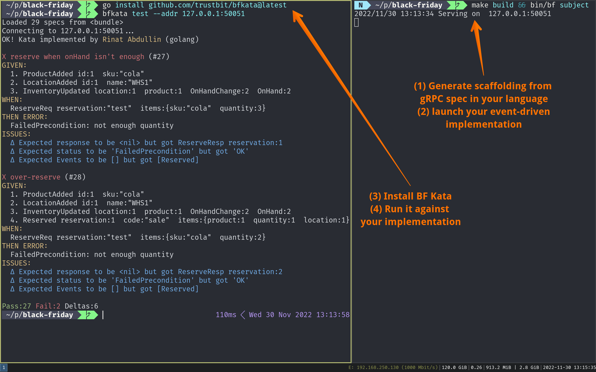

# Black Friday Kata


Status: stabilizing the domain internally at Trustbit. Not for public use, yet.

## Short Story

This is a scaffolding for **DDD and Event Sourcing Kata** from Trustbit. It is about inventory management.

1. Grab protobuf [protobuf definition](api/api.proto) for a small inventory-management server.
2. Generate events and API from that definition for your language
3. Install bfkata binary (either as binary or by running go code from this repo)
4. Run `bfkata test` to verify that behaviors are implemented correctly
5. (Future) Run `bfkata stress` to see how code performs under high load




## Long Story

At Trustbit, we want to make it easy to do a domain-modeling kata with event sourcing in a language of your choice. This is good for learning, sharing, and pushing the state of the art. If you are interested, **please follow along**!

We have picked inventory-management domain, because it brings some interesting behaviors and fault scenarios.

To streamline kata, we took the liberty of:

- Defining the API - it is as minimal as possible
- Defining event contracts
- Writing them down in Google proto3 syntax - so that you can scaffold implementation in a language of your choice
- Writing event-driven specs (tests)
- Bundling these specs in a cross-platform spec runner

In other worlds:
- [api/api.proto](api/api.proto) - defines contracts for API and events;
- [specs/bundle.txt](specs/bundle.txt) - contains tests that define desired behaviors;
- bfkata binary (this project) - tests any implementation.

This kata is solvable without much code. We went ahead and did it ourselves, as a part of Learning & Sharing at Trustbit.

If you want to play with a slighly different API or behaviors, you could easily do so by forking the project and changing API/specs according to your needs.

## Inventory vs Spec APIs

There are two sets of APIs  implement:

- Inventory service - the real service with methods like "add location" and "reserve (inventory)"
- Spec service - special service to run specs remotely.


### 1. Inventory API

Inventory API is as simple as we could get it. It has methods:

- AddLocations 
- AddProducts 
- ListLocations
- MoveLocation
- UpdateInventory
- GetLocInventory
- Reserve

There are following domain events:

- LocationAdded
- LocationMoved
- ProductAdded
- InventoryUpdated
- Reserved

You can find full definition in [api/api.proto](api/api.proto).

### 2. Spec API

This API has two methods:

- About - to return info about the implementation
- Spec - to execute a single event-driven spec against this endpoint. `bfkata` will use it to verify all behaviors.


## Event-Driven Specs

Event-driven specs look like this:

```
move locations
------------------------------------------
GIVEN:
  LocationAdded id:1  name:"Warehouse"
  LocationAdded id:2  name:"Container"
WHEN:
  MoveLocationReq id:2  newParent:1
THEN:
  MoveLocationResp 
EVENTS:
  LocationMoved id:2  newParent:
```

They are bundled as text file in [specs/bundle.txt](specs/bundle.txt).

If you want to play with your own specs, just copy `bundle.txt` someplace, modify and pass to `bfkata test` as `file` argument.

# Running bfkata

To run bfkata.


## With go 1.19 as package

If you have go 1.19 installed on your system (install 1.19, it has generics!), then:

```bash

go install github.com/trustbit/bfkata@latest

# prints:
# go: downloading github.com/trustbit/bfkata v1.0.5

bfkata  

# bfkata - test scaffolding for Black Friday kata. Commands:
#
#  api       - print bundled contracts
#  specs     - print bundled test specs
#  test      - run test suite aginst a provided gRPC endpoint
```

## From source code

Clone this repository then run:

```bash
go run *.go

# bfkata - test scaffolding for Black Friday kata. Commands:
#
#  api       - print bundled contracts
#  specs     - print bundled test specs
#  test      - run test suite aginst a provided gRPC endpoint
```


## From binary

not implemented yet. Ping Rinat (@abdullin on Twitter) to setup proper releases :)